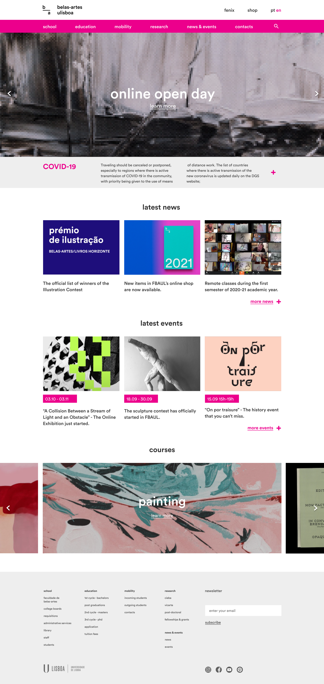
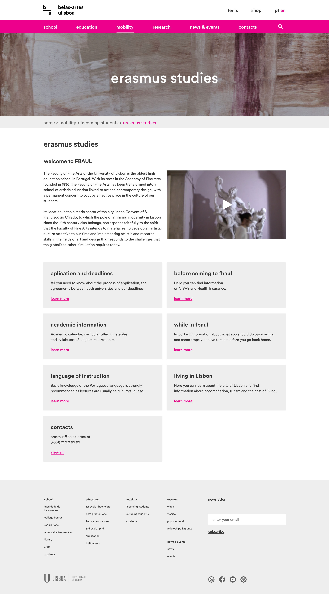
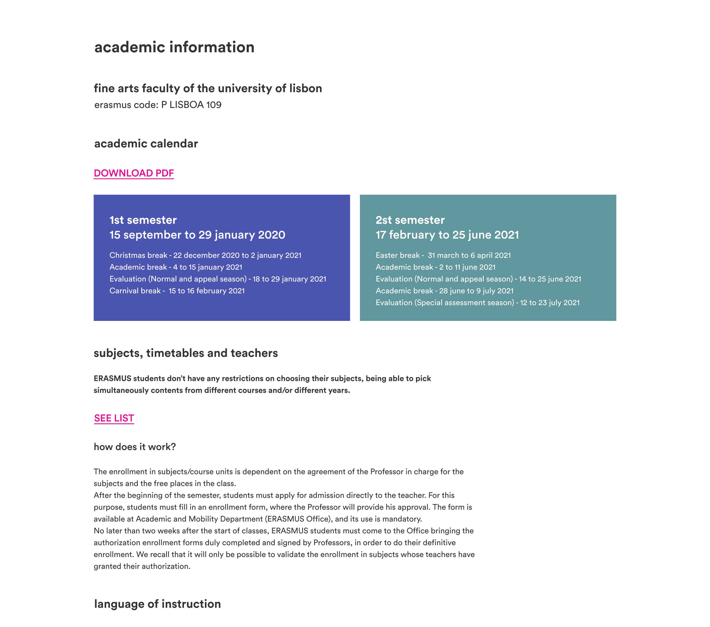
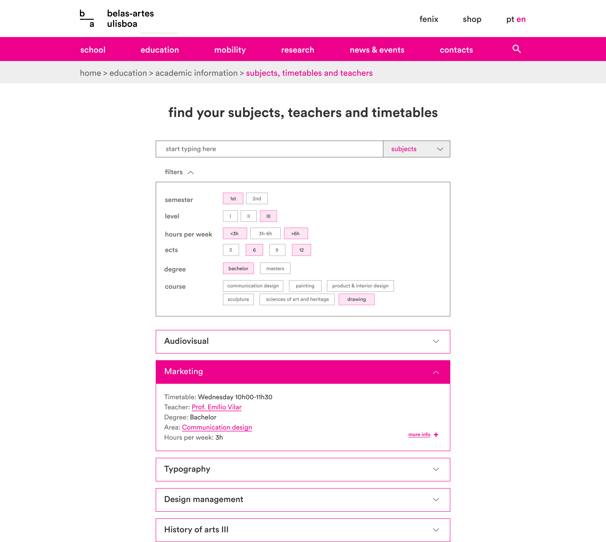
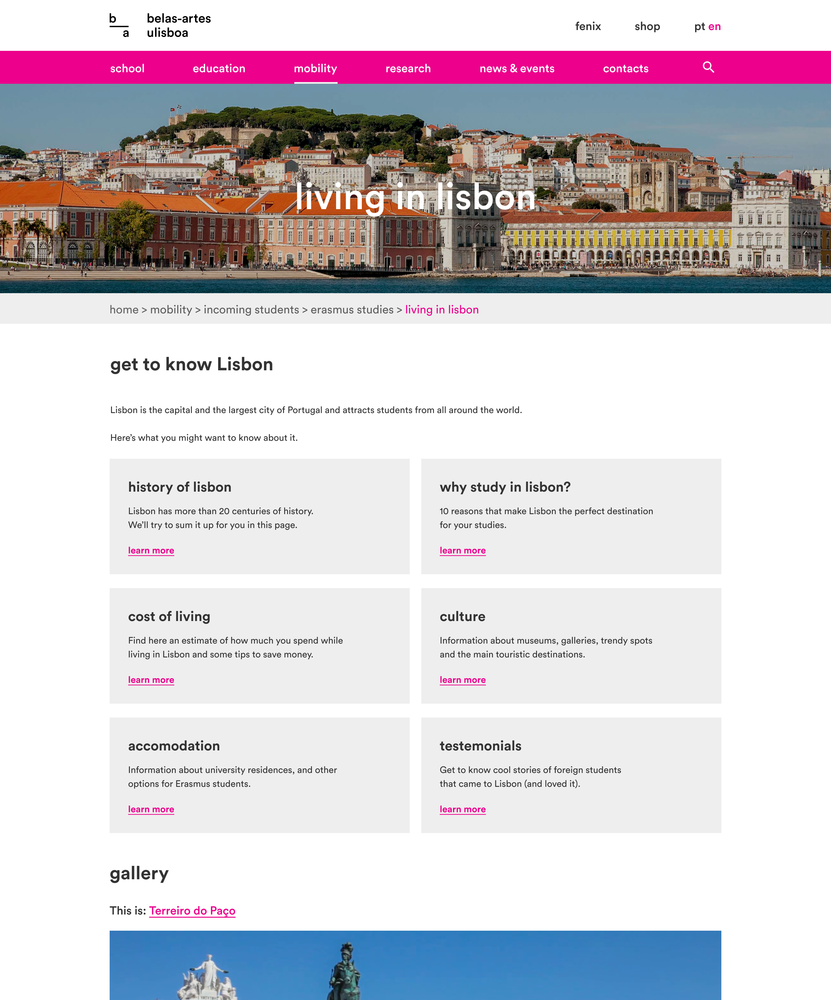

Improving international students’ experience on FBAUL’s website, considering the current pain points.

We went through several UX research methods to understand how the website currently works, its main issues, and then we tried to find solutions to those problems.

The process of developing this project was the following:

    <strong>Research & Analysis</strong>
    <ul>
        <li>Benchmark</li>
        <li>Surveys & interviews</li>
        <li>Insights</li>
        <li>How Might We</li>
    </ul>

    <strong>Ideation</strong>
    <ul>
        <li>Personas</li>
        <li>Customer Journey Map</li>
        <li>Site map</li>
        <li>Ideation</li>
    </ul>

    <strong>Prototyping</strong>
    <ul>
        <li>Sketches</li>
        <li>Wireframes</li>
        <li>Prototype</li>
        <li>Usability test</li>
    </ul>

Learn more on my <a href="https://www.behance.net/gallery/115457783/FBAULs-website-for-International-Students" target="_blank" title="My project on behance">behance</a>

And the results:

<article>
    <h2>Homepage</h2>
    <figure>
        
        <figcaption>
            <strong>Covid-19</strong>
            
We emphasized the information about the main current events.

            <strong>Gallery</strong>
            
We created a gallery that shows all of the faculty's degrees with pictures of student work from these degrees.

            <strong>Footer</strong>
            
We also developed the footer. It now includes the main information of the website, grouped by category, similar to the menu.

        </figcaption>
    </figure>
</article>

<article>
    <h2>Erasmus Studies</h2>
    <figure>
        
        <figcaption>
            <strong>Progress bar</strong>
            
The progress bar is now more visible and acts as a shortcut to return to previous pages.

            <strong>Page Cards</strong>
            
These cards work like a menu of the Erasmus section and give some information about what you would find on these pages.

        </figcaption>
    </figure>
</article>

<article>
    <h2>Academic Information</h2>
    <figure>
        
        <figcaption>
            <strong>Information cards</strong>
            
These cards highlight important information to make it easier to find.

            <strong>Links</strong>
            
We also capitalized and underlined the links to better highlight the additional information.

        </figcaption>
    </figure>
</article>

<article>
    <h2>Course Units page</h2>
    <figure>
        
        <figcaption>
            <strong>Course Units</strong>
            
We created a system that contains on the same page every practical information about the course: course units, professors, and schedules.

        </figcaption>
    </figure>
</article>

<article>
    <h2>Living in Lisbon</h2>
    <figure>
        
        <figcaption>
            <strong>Living in Lisbon details</strong>
            
We also added a section about Lisbon's culture and testimonials of ex-Erasmus students.

        </figcaption>
    </figure>
</article>