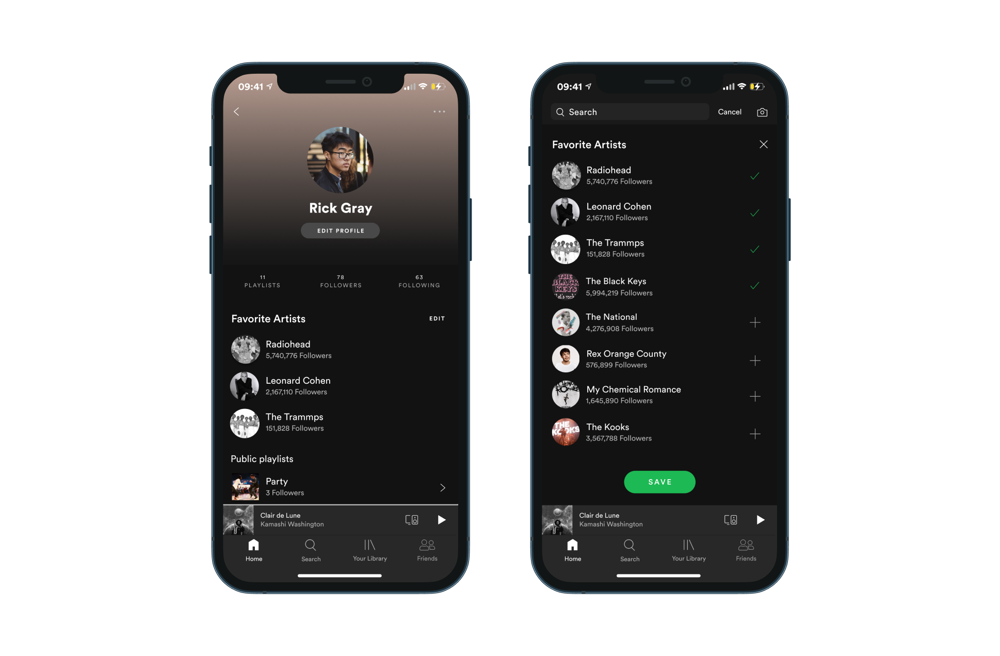

Spotify is the most popular music and podcast streaming platform in the world. It focuses on giving a simple and intuitive experience of listening and finding music.

Despite allowing users to follow their friends and see what they’re listening to, the platform has not developed much further in this social field. To make this platform more social without forgetting its main goal implies thinking of this interaction between friends to be about sharing music.

The process of developing this project was the following:

<section class="grid">
    

        <strong>Research & Analysis</strong>
        <ul>
            <li>Benchmark</li>
            <li>Spotify Analysis</li>
            <li>Social listening</li>
            <li>Surveys & interviews</li>
            <li>SWOT Analysis</li>
        </ul>
    

    

        <strong>Ideation</strong>
        <ul>
            <li>How Might We</li>
            <li>Personas</li>
            <li>Customer Journey Map</li>
            <li>Site map</li>
        </ul>
    

    

        <strong>Prototyping</strong>
        <ul>
            <li>Sketches</li>
            <li>Wireframes</li>
            <li>Prototype</li>
            <li>Usability test</li>
        </ul>
    

</section>

Learn more on my <strong><a href="https://www.behance.net/gallery/111862181/New-social-features-on-Spotify-Concept" target="_blank" title="My project on behance">behance</a></strong>

And the results:

<article class="spotify">
    <h2>Send songs to friends</h2>
    <figure>
        
        <figcaption>
            <strong>Why?</strong>
            
60% wants to recommend and get recommendations from friends directly on Spotify

        </figcaption>
    </figure>
</article>

<article class="spotify">
    <h2>Two new playlists</h2>
    <figure>
        
        <figcaption>
            <strong>Why?</strong>
            
56% wants to have an auto-generated playlist with all of the recommendations

        </figcaption>
    </figure>
</article>

<article class="spotify">
    <h2>Listened by</h2>
    <figure>
        
        <figcaption>
            <strong>Why?</strong>
            
41% wants to see on the content’s menu which of your friends follows that segment

        </figcaption>
    </figure>
</article>

<article class="spotify">
    <h2>Favorite Artists</h2>
    <figure>
        
        <figcaption>
            <strong>Why?</strong>
            
"Instead of the Recently Played Artists, I’d like to be able to share my favorites!"

        </figcaption>
    </figure>
</article>

<article class="spotify">
    <h2>Followers</h2>
    <figure>
        
        <figcaption>
            <strong>Why?</strong>
            
"I love to know who follows my playlists, not being able to see that is bad."

        </figcaption>
    </figure>
</article>

<article class="spotify">
    <h2>Friend Activity</h2>
    <figure>
        
        <figcaption>
            <strong>Why?</strong>
            
"I only use the mobile app so there’s nothing there to see more about my friends’ activity."

        </figcaption>
    </figure>
</article>

<article class="spotify">
    <h2>Privacy Settings</h2>
    <figure>
        
        <figcaption>
            <strong>Why?</strong>
            
"I don’t want Spotify to become a social network. It’s just for listening to music."

        </figcaption>
    </figure>
</article>